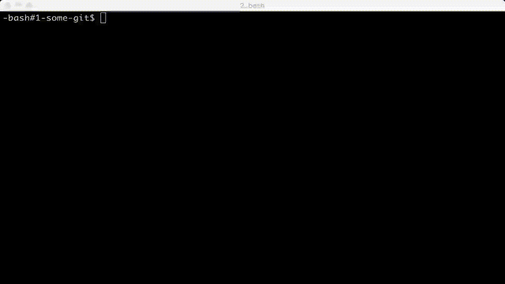

# GLT - Git Local Transform

## Installation

Go 1.6, git and ncurses required.

    go install github.com/nicluo/glt

## Usage

    cd /git-directory/ && glt

## Why

Glt is a wrapper around some git filter-branch commands to edit commit metadata. It doesn't work directly on git object.

Disclaimer: like git amends, best used on commits that are not yet pushed to remote, otherwise `--force` is required.

1.  Sometimes when you run multiple git instances, e.g. in a vagrant/ ssh you end up with wrong author names/emails in environment. Glt lets you correct them.
1.  Change commit messages without changing timestamps for fixing embarassing typos.
1.  Don't be caught committing at 2am (based on a true story), fix timestamps easily (at 2am) with this gui. No regrets.

## Contributing

This is a weekend project, no new features or updates are promised. However, I welcome any comments, discussions or pull requests.
